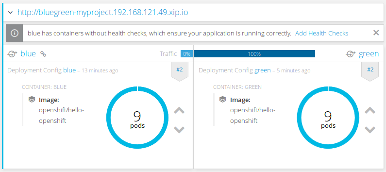
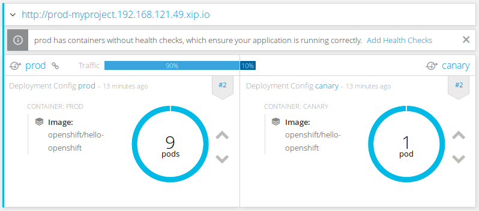
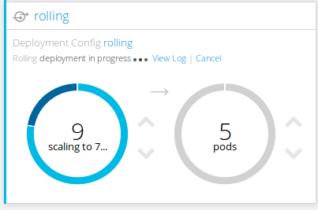

# Colorful deployments

In the current fast-paced world using CI/CD flow seems to be the only reasonable path. I am not going to explain the basics of CI/CD since there are numerous articles available out there, see [1] and [2], for example. In this article, though I will focus on showing off how to implement three deployment strategies (blue-green, canary and rolling) on the latest installment of OpenShift. For the purpose of this article reader is advised to download latest stable version of OpenShift client from [3] and run:

oc cluster up

This will takes a while the first time, since it will download several images needed to run the OpenShift cluster locally on your machine. Once this operation finishes you should see:

???? put ending output from oc cluster up ???

Additionally, you can reach your server from your browser, entering ???? put local server url ???.

## Blue-Green Deployment

Blue-Green deployment, in short, is about having two identical environment, in front of which there is a router or load balancer, which allows to direct traffic to the appropriate environment (see Picture 1). You can read more about Blue-Green deployment in [4]. For the application author, the most important requirement is to support N-1 data schema compatibility. This is because during the upgrade process you are running two applications at the same time.

???? put B/G picture here ????

Picture 1. Blue-Green deployment.

To illustrate this type of deployment we create nine replicas of a blue application:

oc run blue --image=openshift/hello-openshift --replicas=9 # this command creates a deployment running 9 replicas of the specified image
oc set env dc/blue RESPONSE="Hello from Blue" # this sets the environment variable inside the deployment config
oc expose dc/blue # this exposes the deployment internally in the cluster

We will use a hello world application image provided by OpenShift team. By default, this image runs a simple web server returning "Hello world" text, unless RESPONSE environment variable is specified, in which case its value is being returned. For that reason we are setting the RESPONSE value to easily identify our blue version of the application.
Once the application is up and running we need to expose it externally, for that we will use route, which will be also used as the switch between the two different versions of application during the deployment process.

oc expose svc/blue --name=hello # this exposes the application to be available outside the cluster

Now comes the time for performing the upgrade, we create identical environment as the currently running one. To clearly see which version of our application is serving the traffic we are setting RESPONSE to "Hello from Green".

oc run green --image=openshift/hello-openshit --replicas=9
oc set env dc/green RESPONSE="Hello from Green"
oc expose dc/green --port=8080
oc set route-backends hello blue=100 green=0 # this attaches green service under hello route, created earlier but with the entire traffic coming to blue

???? check below  when we need to set route-backends ????
Both of our applications are currently running, but only blue is getting the entire traffic. In the meantime the green aversion goes through all necessary tests (integration, end-to-end, etc.). Only when we are satisfied with the new version working properly (eg. after performing a series of rigorous tetss) we can flip the switch and route the entire traffic to the green environment:

oc set route-backends hello blue=0 green=100

All of the above steps can be performed from the web console, alike. Below is the screenshot showing that traffic is currently served by the green environment.

Picture 2. OpenShift web console, route preview after the switch to green environment.

To shortly summarize Blue Green deployment strategy, let me give you a list of pros and cons of this approach. Zero downtime is by far the biggest feature of this approach, because the switch is almost instantaneous (which is close to ideal), causing users not to notice when their request was served by the new environment. Unfortunately, at the same time this can cause some problems: all currently transactions and sessions will be lost, due to the physical switch from one machine serving the traffic to another one. That is definitely something that should be taken into account when applying this approach. The other important feature of this approach is that tests are performed "in production". Because of the nature of this approach we have full environment for tests (again ideal world for developers), this allows us to have big confidence about the application working correctly. In the worst case, you can always rollback to the old version of the application, as easily. One final disadvantage of this strategy is the need for N-1 data compatibility, which was discussed earlier in the article, and which applies to all of the strategies discussed in this article.

## Canary Deployment

Canary is about deploying application in small, incremental steps and only to small group of people (see [5] for details) . There are a few possible approaches from the simplest being serve only some percentage of the traffic to the new application (I will show how to do that in OpenShift) to a more complicated solutions such as feature toggle (see [6] for details). Which allows you to gate access to certain features based on a very sophisticated criteria (gender, age, country of origin, just to name a few). The most advanced feature toggle I am aware of is currently implemented at Facebook and it is called gatekeeper [7].

???? Canary picture here. ????

Picture 3. Canary deployment.

Let us implement the canary deployment using OpenShift. First we need to create our application, and again we will use the hello-openshift image for that purpose.

oc run prod --image=openshift/hello-openshift --replicas=9
oc set env dc/prod RESPONSE="Hello from Prod"
oc expose dc/prod --port=8080

We need to expose our application to be accessible externally:

oc expose svc/prod

The newer version of the application (called canary) will be deployed similarly but with only single instance.

oc run canary --image=openshift/hello-openshift
oc set env dc/canary RESPONSE="Hello from Canary"
oc espose dc/canary --port=8080
oc set route-backends prod prod=100 canary=0

Since we want to verify if the new version application is working correctly in our the "production" environment, but we only want to expose it to a small amount of clients to gather feedback, we need to configure the route in such a way that it only forwards 10% of the incoming traffic to the newer (canary) version of the application:

oc set route-backends prod prod=90 canary=10

The easiest way to verify this new setup nicely depicted in below screenshot from OpenShift web console we can invoke following loop:

while true; do curl ???? put here the right URL ????; sleep .2; done

Picture 4. OpenShift web console, route preview after sending 10% of the traffic to canary version.

NOTE: There is a connection with how many replicas you have deployed and the percentage of the traffic that is being directed at each version. Since the Service which is in front of the deployment works as a Load balancer in combination with route division, that gives you the actual amount of traffic the application will get. <<<<<----- to we really want this ????

The biggest advantage of this approach is the feature toggle, especially when you have one that allows you to pick the target groups of your application. That connected with user behavior analytics tools will give you a very good feedback about the new features you are considering deploying to a wider audience. Alike blue-green deployment, canary suffers from the N-1 data compatibility, since at any point in time we are running more than one version of the application.

Although, I intentionally did not mentioned that before, there is nothing stopping you from having more than one canary deployments at any point in time. I am hoping that careful reader should easily handle this type of exercise on his own.

## Rolling deployment.

Rolling deployment is the default deployment strategy in OpenShift [8]. In short this process is about slowly replacing currently running instances of our application with newer ones. The process is best illustrated with the following animation:

???? Rolling picture here. ????

Picture 5. Rolling deployment.

On the left we have a currently running version of our application, on the right side we have a newer version of that same application. We see that at any point in time we have exactly N+1 instance running. These parameters can be easily tweaked in deployment strategy parameters in OpenShift.

Picture 6. Rolling deployment parameters in OpenShift web console.

Let us then create an application whi

oc run rolling --image=openshift/hello-openshift --replicas=9
oc expose dc/rolling --port 8080
oc expose svc/rolling

All we need to do now is to trigger a new deployment. To do so, we will change configuration of the deployment by setting environment variable, which should trigger a new deployment. This is because all deployment by default have a ConfigChange trigger defined (you can read more about it in [9]).

oc set env dc/rolling RESPONSE="Hello from new roll"

It is best to switch to OpenShift's web console to see the process in action.

The benefits of this approach is the incremental rollout of your application and gradual verification of the application with increasing traffic. As downsides, we are again struggling with N-1 compatibility problem which is a key requirement for all Continuous Deployment approaches. One additional downside is N+1 instances, although this compared to Blue Green requirement of having identical environment is not that painful. Lost transactions, logged-off users.

Summary

No silver bullet, there’s no one fit all approach. It is is important to fully understand all good sides and down side of every possible approach. Additionally, it is important that both developers and operations team cooperate tightly when picking the right approach for them. Finally, although my presentation focused on each of these strategies by themselves there is nothing wrong with combining them together to have the best possible solution that fits best our application and approach.

[1] https://martinfowler.com/articles/continuousIntegration.html
[2] https://martinfowler.com/bliki/ContinuousDelivery.html
[3] https://github.com/openshift/origin/releases
[4] https://martinfowler.com/bliki/BlueGreenDeployment.html
[5] https://martinfowler.com/bliki/CanaryRelease.html
[6] https://martinfowler.com/articles/feature-toggles.html
[7] https://www.facebook.com/notes/facebook-engineering/building-and-testing-at-facebook/10151004157328920/
[8] https://docs.openshift.org/latest/dev_guide/deployments/deployment_strategies.html#rolling-strategy
[9] https://docs.openshift.org/latest/dev_guide/deployments/basic_deployment_operations.html#config-change-trigger
